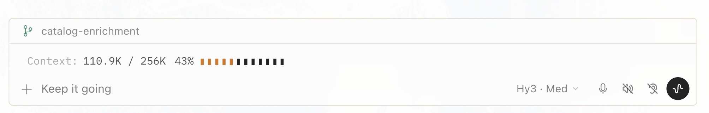

# workspace-context

A [Hermes Agent](https://github.com/NousResearch/hermes-agent) desktop plugin that shows the **active session's context-window usage** above the message composer — mirroring the app's own status bar.

```
Context: 42.2K / 256K  16%  ▮▮▯▯▯▯▯▯▯▯▯▯▯
```



*The strip shows the active session's live context usage — here `110.9K / 256K (43%)` with a segmented bar — sitting above the composer controls.*

## What it does

- Renders a compact, monospace readout above the composer: `used / total`, a percentage, and a segmented bar.
- **Per-session:** each chat keeps its own last-known usage, so switching sessions shows that session's numbers — not the last one you used.
- **Live:** updates from the gateway `session.info` event stream (the same source the core status bar reads).
- **Safe & local:** no backend, no network calls, no credentials. Usage is read-only and cached in plugin-scoped storage (capped at the 30 most recent sessions).
- When a session has no usage yet, it shows just `Context:` — nothing else.

## Install

From the [community index](https://github.com/Revell-ai/hermes-plugin-index) (after the entry is merged):

```bash
hermes plugins install workspace-context
```

Or manually:

1. Download `plugin.yaml` and `desktop/plugin.js` from this repo.
2. Place them at `<HERMER_HOME>/plugins/workspace-context/` so the layout is:
   ```
   workspace-context/
   ├── plugin.yaml
   └── desktop/
       └── plugin.js
   ```
   - macOS: `~/Library/Application Support/Hermes/.hermes/plugins/workspace-context/`
   - Linux: `~/.hermes/plugins/workspace-context/`
3. Enable it: `hermes plugins enable workspace-context` (or it's auto-discovered).
4. In the desktop app: **⌘K → "Reload desktop plugins"** (or quit and reopen).

> The standalone `desktop-plugins/` door also works: drop the folder at
> `<HERMES_HOME>/desktop-plugins/workspace-context/` (with `plugin.js` at the
> root) — it's default-on and needs no `plugins.enabled` entry. On macOS, copy
> `desktop/plugin.js` to the folder root rather than symlinking; some app
> sandboxes won't follow the symlink.

## How it works

The plugin is a single ESM file (`desktop/plugin.js`) loaded by the Hermes
desktop plugin runtime. It uses only the public plugin SDK:

- `host.onEvent('session.info', …)` — subscribes to the per-session
  `UsageStats` stream (deep-searches the event for `context_used` /
  `context_max` / `context_percent`, since builds nest them differently).
- `host.state.focusedSessionId` (falling back to `activeSessionId`) — keys the
  reading to the focused session.
- `host.storage` — persists per-session usage, capped, so storage can't grow
  without bound.
- `COMPOSER_AREAS.top` — mounts the strip above the composer.

A reading is only accepted when `context_max > 0`, so an empty/draft-session
event can never blank a real value.

## Layout

```
workspace-context/
├── plugin.yaml      # manifest (name, description, version; desktop-only, no backend)
├── desktop/
│   └── plugin.js    # the plugin
├── screenshot.png   # preview shown in this README
└── README.md
```

## License

MIT
